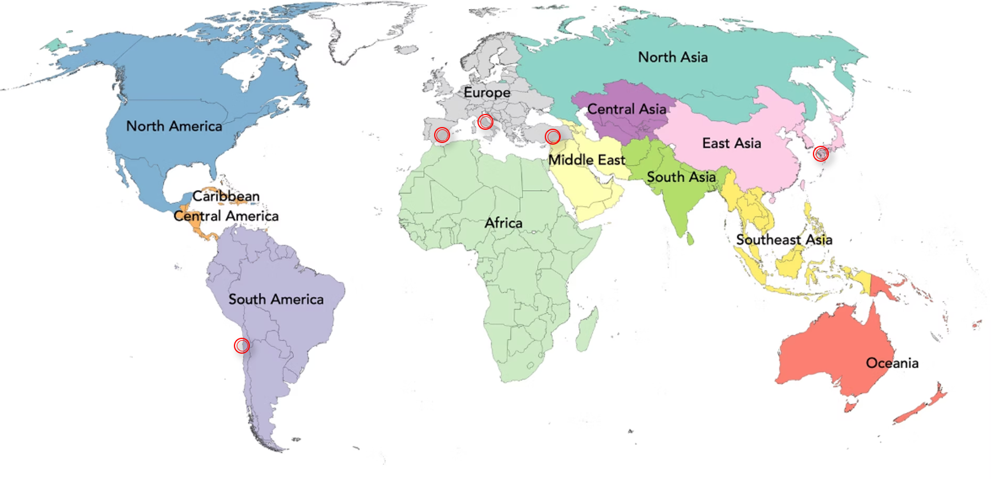
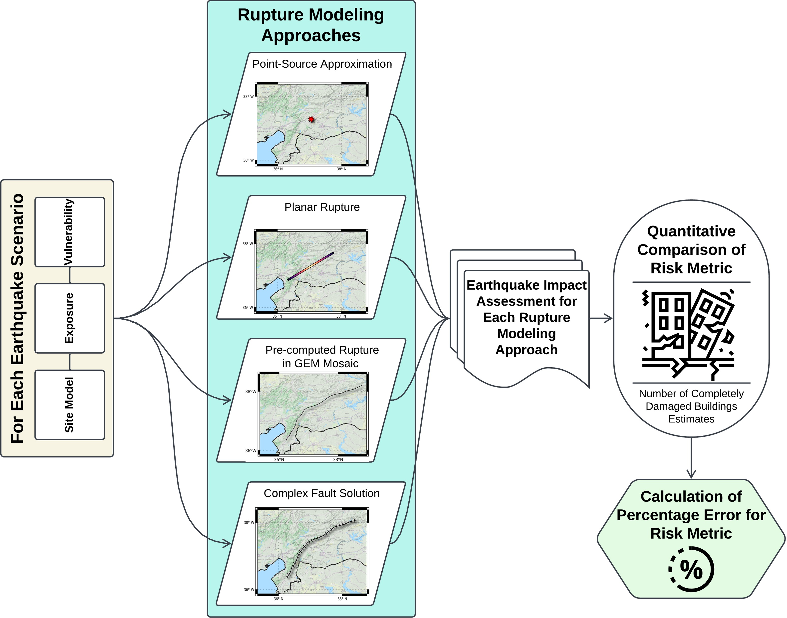

<h1 align="left">
  📋
   Overview
</h1>

This repository serves as an archive for the  rupture models used in the study, "Impact of Rupture Geometry Modeling on Rapid Earthquake Loss Assessments." The research addresses a pivotal challenge in the field of rapid impact assessment: the accurate quantification of ground-shaking intensity in the immediate aftermath of a significant seismic event, when constraints on finite-fault rupture geometry are typically limited. To systematically investigate this issue, the study conducts a rigorous comparative analysis of different rupture modeling methodologies. These approaches are from simplified Point-Source approximations to more geometrically refined Planar and Pre-Calculated rupture models. The performance of these rupture models is evaluated against a Benchmark rupture model, which is based on detailed, published finite-fault solutions where available.

The evaluation framework is applied to a comprehensive suite of scenario earthquakes, meticulously selected to encompass a diverse range of seismic magnitudes and tectonic settings. This enables a robust and systematic comparison, evaluating the sensitivity of loss estimates to the choice of rupture characterization across different seismogenic environments. 

<h1 align="left">
  💥
   Earthquake Scenarios 
</h1>

To evaluate the impact of rupture modeling approaches on the seismic loss estimates, we selected five historical earthquakes based on diverse criteria:

### - Magnitude Range
- **Spectrum:** Mw 5.1 to Mw 8.2
- **Purpose:** Assess rupture size influence across scales

### - Geographic Context  
- **Inland Urban:** 2007 Mw 7.0 Kumamoto, Japan
- **Offshore Coastal:** 2014 Mw 8.2 Iquique, Chile

### - Rupture Complexity
- **Complex Geometry:** 2023 Mw 7.8 Kahramanmaras, Türkiye
- **Challenge:** Arcuate shapes vs rectangular approximations

### - Structural Vulnerability
- **High Vulnerability:** Italy, Türkiye (vulnerable houses)
- **Code-Compliant:** Japan (engineered structures)

  

<table>
  <thead>
    <tr>
      <th rowspan="2">Earthquake Scenario (Country)</th>
      <th rowspan="2">Mw (USGS)</th>
      <th rowspan="2">Depth (km)</th>
      <th rowspan="2">Faulting Mechanism</th>
      <th colspan="3">Causative Nodal Plane Solution</th>
      <th rowspan="2">Finite-Fault Solution</th>
      <th rowspan="2">Seismic Hazard Model</th>
    </tr>
    <tr>
      <th>Strike</th>
      <th>Dip</th>
      <th>Rake</th>
    </tr>
  </thead>
  <tbody>
    <tr>
      <td>Iquique (Chile)</td>
      <td>8.2</td>
      <td>25</td>
      <td>Thrust</td>
      <td>358a</td>
      <td>12°</td>
      <td>107°</td>
      <td>Hayes (2017)</td>
      <td>Garcia et al. (2017)</td>
    </tr>
    <tr>
      <td>Kahramanmaraş (Türkiye)</td>
      <td>7.8</td>
      <td>8.6</td>
      <td>Strike-slip</td>
      <td>233b</td>
      <td>74°</td>
      <td>18°</td>
      <td>Goldberg et al. (2023)c</td>
      <td>Danciu et al. (2020)</td>
    </tr>
    <tr>
      <td>Kumamoto (Japan)</td>
      <td>7.0</td>
      <td>10</td>
      <td>Strike-slip</td>
      <td>224d</td>
      <td>66°</td>
      <td>-152°</td>
      <td>Yagi et al. (2016)</td>
      <td>HERP (2014)</td>
    </tr>
    <tr>
      <td>L'Aquila (Italy)</td>
      <td>6.3</td>
      <td>8.8</td>
      <td>Normal</td>
      <td>121e</td>
      <td>43°</td>
      <td>-124°</td>
      <td>Gallovič et al. (2015)</td>
      <td>Danciu et al. (2020)</td>
    </tr>
    <tr>
      <td>Lorca (Spain)</td>
      <td>5.1</td>
      <td>1</td>
      <td>Strike-slip</td>
      <td>233f</td>
      <td>45°</td>
      <td>42°</td>
      <td>Lopez-Camino et al. (2016)</td>
      <td>-</td>
    </tr>
  </tbody>
</table>

- a: https://earthquake.usgs.gov/earthquakes/eventpage/usc000nzvd/moment-tensor
- b: https://deprem.afad.gov.tr/event-detail/408326
- c: https://earthquake.usgs.gov/product/shakemap/us6000jllz/us/1675660631596/download/rupture.json
- d: https://earthquake.usgs.gov/earthquakes/eventpage/us20005iis/moment-tensor  				
- e: https://earthquake.usgs.gov/earthquakes/eventpage/usp000gvtu/moment-tensor   
- f: https://earthquake.usgs.gov/earthquakes/eventpage/usp000j1en/moment-tensor  	

<h1 align="justify">
  🔬
   Methodology 
</h1>

The computational implementation and evaluation of these diverse rupture modeling methodologies were conducted utilizing the OpenQuake engine (Pagani et al., 2014; Rao et al., 2025), an open-source seismic hazard and risk analysis toolkit. This comparative analysis, conducted on a set of earthquake scenarios from five seismically active countries (Chile, Turkey, Japan, Italy and Spain), examines how the influence of rupture patterns systematically influences loss estimates (number of completely damaged buildings). The methodological workflow employed in this investigation, from rupture generation to final impact assessment, is systematically delineated in the flowchart presented below.

  

<h1 align="left">
  🧾
   References 
</h1>

###### **Danciu, L., Giardini, D., Weatherill, G., Basili, R., Nandan, S., Rovida, A., Beauval, C., Bard, P.-Y., Pagani, M., Reyes, C. G., Sesetyan, K., Vilanova, S., Cotton, F., and Wiemer, S.** The 2020 European Seismic Hazard Model: overview and results, Nat. Hazards Earth Syst. Sci., 24, 3049–3073.

###### **Gallovič, F., Imperatori, W., & Mai, P. M.** (2015). Effects of three-dimensional crustal structure and smoothing constraint on earthquake slip inversions: Case study of the Mw6.3 2009 L'Aquila earthquake. Journal of Geophysical Research, 120, 428–449.

###### **Garcia J, Weatherill GW, Pagani M, Rodriguez L and Poggi V and the SARA Working Group** (2017) Building an open seismic hazard model for South America: The SARA-PSHA model. In: Proceedings of the 16th world conference on earthquake engineering, Santiago, 9–13 January.

###### **Goldberg, D. E., Taymaz, T., Reitman, N. G., Hatem, A. E., Yolsal‐Çevikbilen, S., Barnhart, W. D., Irmak, T. S., Wald, D. J., Öcalan, T., Yeck, W. L., Özkan, B., Jobe, J. A. T., Shelly, D. R., Thompson, E. M., DuRoss, C. B., Earle, P. S., Briggs, R. W., Benz, H., Erman, C., Doğan, A. H., & Altuntaş, C.** (2023). Rapid characterization of the February 2023 Kahramanmaraş, Türkiye, earthquake sequence. The Seismic Record, *3*(2), 156–167.

###### **Hayes, G.P., Myers, E.K., Dewey, J.W., Briggs, R.W., Earle, P.S., Benz, H.M., Smoczyk, G.M., Flamme, H.E., Barnhart, W.D., Gold, R.D., and Furlong, K.P.** (2017). Tectonic summaries of magnitude 7 and greater earthquakes from 2000 to 2015: U.S. Geological Survey Open File Report 2016–1192, 148 p.

###### **HERP** (2014). Headquarters for Earthquake Research Promotion. The National Seismic Hazard Map 2014 version—with an overview on the ground motion hazard of the whole country. Technical report, Headquarters for Earthquake Research Promotion (in Japanese). Available at: https://www.jishin.go.jp/evaluation/seismic_hazard_map/shm_report/shm_report_2014/ (last accessed May 2025).

###### **López-Comino, J. A., Stich, D., Morales, J., & Ferreira, A.** (2016). Resolution of rupture directivity in weak events: 1D versus 2D source parameterizations for the 2011, Mw 4.6 and 5.2 Lorca earthquakes, Spain. Journal of Geophysical Research, 121(8), 6608–6626.

###### **Pagani, M., Monelli, D., Weatherill, G., et al.** (2014). OpenQuake engine: An open hazard (and risk) software for the global earthquake model. Seismological Research Letters, 85(3), 692–702.

###### **Rao A, Yepes-Estrada C, Johnson K, Todorović L, Pagani M, Simionato M, Styron R, Silva V, Crowley H** (2025). Evolution of the OpenQuake Engine: Enhanced Capabilities, Collaborative Development, and Global Adoption. Earthquake Spectra, in press.

###### **Yagi, Y., Okuwaki, R., Enescu, B., Kasahara, A., Miyakawa, A., & Otsubo, M.** (2016). Rupture process of the 2016 Kumamoto earthquake in relation to the thermal structure around Aso volcano. Earth, Planets and Space, 68(1), 1–6.
